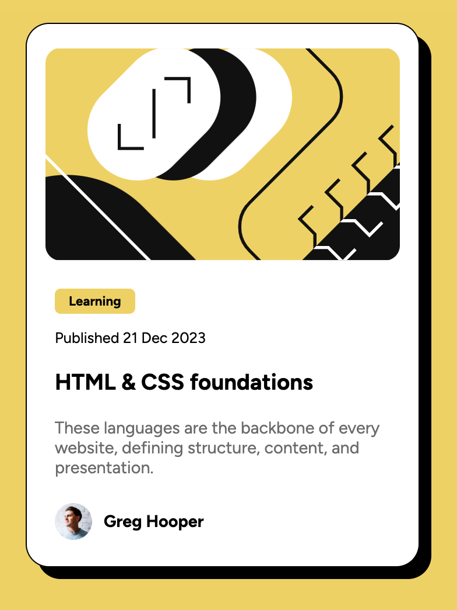

# Frontend Mentor - Blog preview card solution

This is a solution to the [Blog preview card challenge on Frontend Mentor](https://www.frontendmentor.io/challenges/blog-preview-card-ckPaj01IcS).

## Table of contents

- [Overview](#overview)
  - [The challenge](#the-challenge)
  - [Screenshot](#screenshot)
  - [Links](#links)
- [My process](#my-process)
  - [Built with](#built-with)
  - [What I learned](#what-i-learned)
- [Author](#author)

**Note: Delete this note and update the table of contents based on what sections you keep.**

## Overview

### The challenge

Users should be able to:

- See hover and focus states for all interactive elements on the page

### Screenshot

### Links

- Solution URL: [Solution](https://github.com/minahopgood/blop-preview-card)
- Live Site URL: [Finished worl](https://minahopgood.github.io/blop-preview-card/)

## My process

### Built with

- Semantic HTML5 markup
- Flexbox

### What I learned

During this challenge, I tried to focus on using the em and rem units. Initially I was using px units only, but after receiving feedback on my previous challenge about using em and rem units to improve website responsivenss, I switched it over. Although, it's still confusing, I feel as though I have a better grasp on how to use these and will try and implement them more in the future.

I also struggled with sizing the image on this preview. The solution for this was to also switch from px to em units, as it allowed for the container and items to sit within each other without worrying about exact spacing.

## Author

- GitHub - [Mina Hopgood](https://github.com/minahopgood)
- Frontend Mentor - [@minahop](https://www.frontendmentor.io/profile/minahopgo
